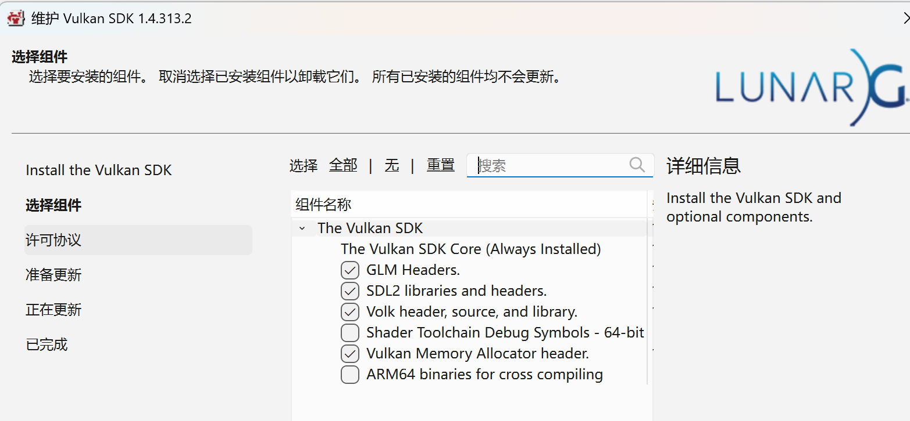

# Vulkan教程
参考网站为 [Vulkan Tutorial](https://vulkan-tutorial.com/en)

首先下载安装[VulkanSDK](https://vulkan.lunarg.com/sdk/home)
我安装的组件如下


安装好后添加环境变量`VulkanSDK`，值为你的安装目录`C:\VulkanSDK\1.4.313.2`，
再在`Path`中添加`%VulkanSDK%\Bin`

项目使用[Clion](https://www.jetbrains.com/clion/)进行开发，编译环境是vs2019，都是用的免费版本

## 项目结构说明

- 3rdparty
  - glfw
  - glm
  - ...
- sources
  - 00_base_code
  - 01_ ...

3rdparty为依赖的三方库  
sources下的文件夹为每一节的示例项目

# 环境构建
默认已经安装好VulkanSDK、Clion与vs2019社区版，且设置好了上面说的环境变量

将项目克隆下来，然后运行下面命令
下载三方库
``` shell
cd 3rdparty
# 下载最新发布的glfw版本，3.4为目前最新的版本
git clone --depth 1 --branch  3.4 https://github.com/glfw/glfw.git glfw
```
重新cmake一下，即可运行示例。00示例只创建了一个窗口，代码里是整个程序的框架，后续就是加函数并调用。
代码里添加了一些注释，可以直接看代码来学习，一共有32节，分别标为00到31

# 绘制一个三角形
## 1 基础配置
### 00 创建窗口
使用GLFW创建，直接看00的示例代码

### 01 创建实例
调用`vkCreateInstance`函数

### 02 添加验证层
用来Debug，创建验证层来检查调用是否有问题，使用回调函数来自己处理这些信息

### 03 选择物理设备与队列簇
选择一个GPU和合适的队列簇，调用`vkEnumeratePhysicalDevices`来获取电脑中GPU的个数和`VkPhysicalDevice`  
调用`vkGetPhysicalDeviceQueueFamilyProperties`来获取队列簇的属性，来判断选取哪个队列簇
调用`vkGetPhysicalDeviceProperties`与`vkGetPhysicalDeviceFeatures`来查询GPU的基础属性与其他可选功能
可以对显卡进行打分，选择分数最高的那个

### 04 创建逻辑设备与队列
逻辑设备和队列都是通过调用`vkCreateDevice`来创建的，一般只创建一个队列  
逻辑设备如果需要可以创建多个

## 2 窗口与图像视图